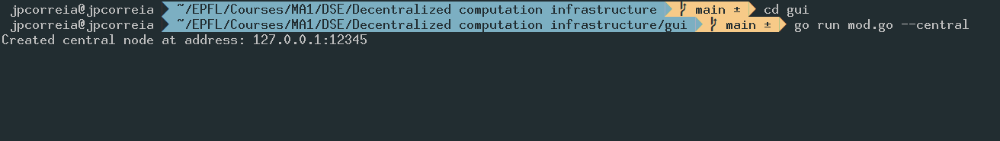
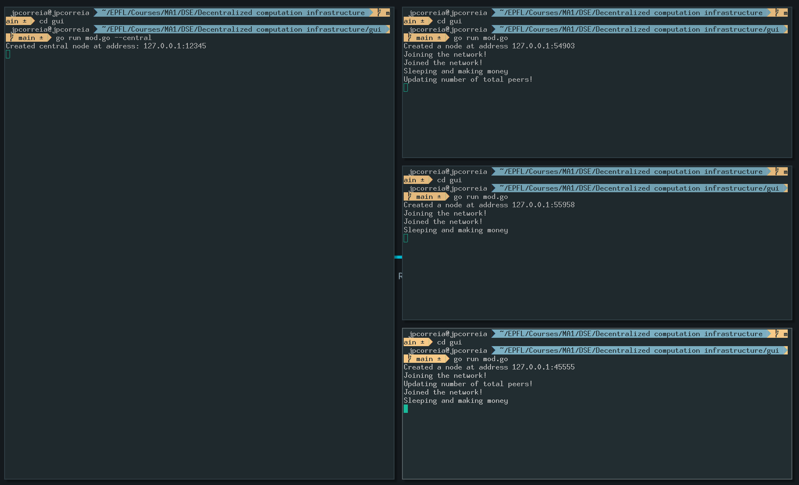
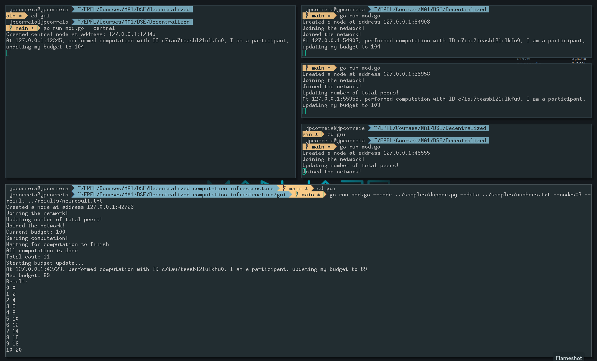
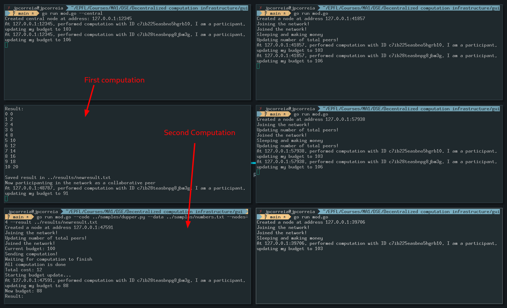

# DeCI - Decentralized computation framework

Intructions to run:
1. cd to gui folder: _cd gui_
2. launch the central node: _go run mod.go --central_

3. launch as many other passive nodes (nodes lending resources) as desired: _go run ./mod.go_

4. launch the issuer node: _go run mod.go --code ../samples/dupper.py --data ../samples/numbers.txt --nodes=3 --result ../results/newresult.txt_

-- code: path to executable 

-- data: path to inputs 

-- nodes: number of nodes to request 

-- result: path to store the result

The provided values are just examples

After executing step 4 and getting the computation results, the issuer node joins the network as a passive node.
Therefore, to issue more computations please open a new issuer node by rerunning step 4 in another terminal.

